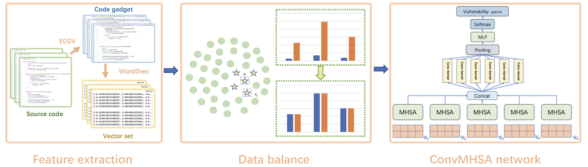

# ConvMHSA-SCVD (ISSRE 2023)

Code and datasets for ConvMHSA-SCVD: Enhancing Smart Contract Vulnerability Detection through a Knowledge-Driven and Data-Driven Framework

This paper has been accepted in ISSRE2023

## How to use 

You can start the model with the following command

```
python main.py --model ConvMHSA 
```

## Model-Architecture


